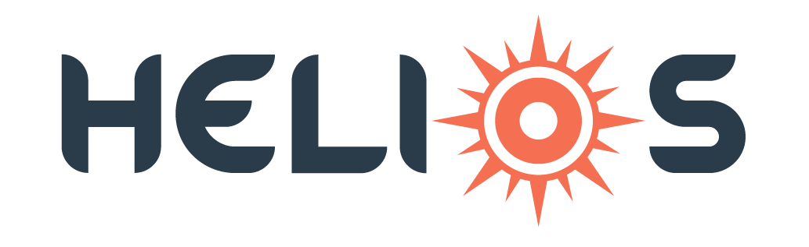

<!--
*** This ReadMe document was insipred by the ReadMe template from
*** https://github.com/othneildrew/Best-README-Template
-->


<!--
*** https://www.markdownguide.org/basic-syntax/#reference-style-links
-->

<!-- PROJECT LOGO -->
<div  align="center">

<h1>AWS Serverless Applications Monitoring Tool</h1>

<!-- PROJECT SHIELDS -->
[![Contributors][contributors-shield]][contributors-url]
[![Stargazers][stars-shield]][stars-url]
[![Issues][issues-shield]][issues-url]
[![MIT License][license-shield]][license-url]

</div>


<!-- TABLE OF CONTENTS -->
<details open="open">
  <summary>Table of Contents</summary>
  <ol>
      <li><a href="#motivation-for-project">Motivation for Project</a></li> 
      <li><a href="#getting-started">Getting Started</a></li>      
      <li><a href="#aws-end-users">AWS End Users</a></li>
      <ul>
        <li><a href="#installation-and-setup">Installation and Setup</a></li>      
        <li><a href="#lambda-metrics">Lambda Metrics</a></li>
        <li><a href="#logs">Logs</a></li>
        <li><a href="#api-gateway">API Gateway</a></li>     
        <li><a href="#user-profile">User Profile</a></li>     
      </ul>
      <li><a href="#developers">Developers</a></li>
      <ul>
            <li><a href="#built-with">Built With</a></li>     
            <li><a href="#project-setup">Project Setup</a></li> 
                  </ul>
    <li><a href="#contributors">Contributors</a></li>
    <li><a href="#license">License</a></li>
  </ol>
</details>

<!-- ABOUT THE PROJECT -->

## Motivation for Project

Serverless Applications are increasing becoming popular as it relieves the organizations and programmers from worrying about provisioning and maintining the servers to just focusing on developing and deploying the code. It is also cost-effiecient in many scenarios as servers are running only when an event (for e.g. an API request) is triggered.

AWS is a leading provider in the serverless applications space with AWS Lambda functions being it's central component of the architecture.However, with AWS’ numerous services and extensive docs, it becomes challenging to navigate and can be intimidating to monitor and track the health of serverless applications.

Helios is a free, open-source monitoring tool that users can connect to their AWS account and easily track key metrics and logs. Here is a [medium](https://mediumarticle.com) article describing the philosophy behind Helios. The application can be downloaded [here](https://projecthelios.io). Helios is preconfigured to track the following three main components of AWS serverless applications.

* [Lambda Metrics](#lambda-metrics)
* [Logs](#logs)
* [API Gateway](#api-gateway)


<!-- GETTING STARTED -->

## Getting Started

The following instructions are split into two sections for:

* [AWS End Users](#aws-end-users)
* [Developers](#developers)

## AWS End Users

This section describes the instructions for AWS end users who would like to [download](https://projecthelios.io) the application and connect their AWS account. For developers who would like to contribute to the open-source project follow these [instructions](#developers)

### Installation and Setup

1. Download the Helios application [here](https://projecthelios.io)
2. Existing users enter email and password to login
3. For new users click Signup to create a new user account
4. Follow the instructions and complete the steps to connect AWS account
5. Copy and paste the unique AWS ARN access key from the prior step
6. Select the AWS Region where the serverless applications are deployed
7. You're all set to start monitoring!


<p  align="center">

</br>

</p>

The Helios application is preconfigured to track three main components of AWS serverless applications. Once the user is logged in these components can be visualized through the side navigation menu.

### Lambda Metrics

Displays the aggregated metrics for their Lambda functions including: Throttles, Invocations, and Errors. The metric totals by Lambda function are also shown in tabular format. Users have an option to further visualize metrics for specific functions. Users can adjust the time period for displyaing the metrics

<!-- UPDATE GIF FOR DASHBOARD -->


### Logs

Displays the logs and errors by AWS Lambda function. Users just have to click the Lambda function logs they wish to see and Helios will fetch and organize them. Any errors that might be occurring are also separated into their own tab for quick identification. Users can adjust the time period for displyaing the logs


<p  align="center">

</p>

### API Gateway

On the API Gateway page, users can identify all the resources/paths and methods that exist on AWS API Gateway service as well as their endpoints (if applicable). This will help bring clarity to understanding which route is driving to which Lambda function. If an API is clicked, users will also be able to visualize the following metrics for that API in a given time period.

  <ul>
    <li>API Latency (the time between when the API receives a request from a client and when it returns a response to the client)</a></li>
    <li>Count (the total number of requests to the API)</li>
    <li>5XX Errors (the number of server-side errors captured)</li>
    <li>4XX Errors (the number of client-side errors captured)</li>
  </ul>

<p  align="center">

</p>

### User Profile

Users can update the profile and their default AWS region on the User Profile page. Here, they can also update the AWS account they have linked (by going through the StackFormation process again with a different AWS account and then providing Helios with the updated ARN). They could also update their email and/or password, if they so wish.

It's that simple and easy to use!!

## Developers

This section describes the instructions for developers who like to download and contribute to the open-source Helios project. For AWS end users who would like to download the application and connect their AWS account follow these [instructions](#aws-end-users) instead.

### Built With

Helios application was built using the following key frameworks / libraries for the front-end and back-end:

- [React](https://reactjs.org/)
- [Redux](https://redux.js.org/)
- [Material-UI](https://material-ui.com/)
- [NodeJS](https://nodejs.org/en/)
- [Express](https://expressjs.com/)
- [MongoDB](https://www.mongodb.com/)
- [Mongoose](https://mongoosejs.com/)
- [Electron](https://www.electronjs.org/)

### Project Setup

The pre-requisite software for setting up this application are:

- [NodeJS](https://nodejs.org/en/)
- [NPM ](https://www.npmjs.com/)

1. Clone the repo
   ```sh
   git clone https://github.com/oslabs-beta/Helios.git
   cd Helios
   ```
2. Install the package dependencies
   ```sh
   npm install
   ```
3. Update the `.env` file in the project root directory with the necessary credentials
   install

4. Build and run the application (in Electron) with the following commands. This should start up the electron application
   ```sh
   npm run build
   npm start
   ```
5. Additionaly the application can be run in development mode. Run the following command and go to http://localhost:8080/ on your browser
   ```sh
   npm run dev
   ```

<!-- CONTACT -->

## Contributors
- Jackie Douglass - [Github](https://github.com/jackiedouglass) | [Linkedin](https://www.linkedin.com/in/jacqueline-douglass//)
- Prasad Pulaguntla -[Github](https://github.com/prasad-pul) | [Linkedin](https://www.linkedin.com/in/prasad-pulaguntla/)
- Thein Gi Deva - [Github](https://github.com/theingideva) | [Linkedin](https://www.linkedin.com/in/thein-gi-deva-88826673/)


Project Links: [Website](https://projecthelios.io) | [Github](https://github.com/oslabs-beta/Helios) | [Linkedin](https://github.com/oslabs-beta/Helios)

<!-- LICENSE -->

## License

Distributed under the MIT License.

<!-- MARKDOWN LINKS & IMAGES -->
<!-- https://www.markdownguide.org/basic-syntax/#reference-style-links -->

[contributors-shield]: https://img.shields.io/github/contributors/oslabs-beta/Helios.svg?style=for-the-badge
[contributors-url]: https://github.com/oslabs-beta/Helios/graphs/contributors
[stars-shield]: https://img.shields.io/github/stars/oslabs-beta/Helios.svg?style=for-the-badge
[stars-url]: https://github.com/oslabs-beta/Helios/stargazers
[issues-shield]: https://img.shields.io/github/issues/oslabs-beta/Helios.svg?style=for-the-badge
[issues-url]: https://github.com/oslabs-beta/Helios/issues
[license-shield]: https://img.shields.io/github/license/oslabs-beta/Helios.svg?style=for-the-badge
[license-url]: https://github.com/oslabs-beta/Helios/blob/master/LICENSE.txt
[linkedin-shield]: https://img.shields.io/badge/-LinkedIn-black.svg?style=for-the-badge&logo=linkedin&colorB=555
[linkedin-url]: https://linkedin.com/in/projectHelios
[product-screenshot]: client/src/Dashboard/assets/img/helios-blue-logo-t.png
